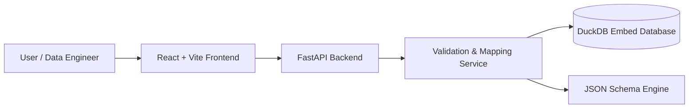

# 🛡️ Schema Guard MVP

> **Validate, Version, and Normalize your Data with Confidence.**

Schema Guard is a robust, lightweight solution designed to solve the chaos of data ingestion. It acts as a gatekeeper, ensuring that incoming datasets (JSON or CSV) conform to strict, versioned schemas before they enter your data lake or processing pipelines.

---

## 📖 Introduction

In modern data engineering, "dirty data" is the silent killer of pipelines. Schema Guard provides a centralized **Schema Registry** and a powerful **Validation Engine** to enforce quality standards.

It allows you to:
1.  **Define Contracts:** Register JSON Schemas for your datasets (e.g., Procurement, Retail).
2.  **Validate Instantly:** Check if files comply with these contracts.
3.  **Adapt & Fix:** Automatically map and normalize mismatched column names (e.g., legacy Portuguese headers -> standard English fields).

---

## 🏗️ Technical Architecture

The project follows a modern, decoupled architecture:



### Components

1.  **Frontend (React 18 + TypeScript)**
    *   **Dashboard:** A responsive, modern UI built with **Tailwind CSS**.
    *   **Features:** One-click schema registration, drag-and-drop validation, visual tutorial, and bilingual support (EN/PT).
    *   **State Management:** React Hooks (`useState`, `useEffect`) for a lightweight footprint.

2.  **Backend (Python 3.12 + FastAPI)**
    *   **API Layer:** High-performance REST API handling schema CRUD and file uploads.
    *   **Services:**
        *   `services.py`: Core logic for versioning, validation, and mapping application.
    *   **Database:** **DuckDB** is used as an embedded SQL engine for storing schema versions and mapping rules efficiently without the overhead of Postgres.

3.  **Core Engines**
    *   **Validation:** `jsonschema` library for strict contract enforcement.
    *   **Transformation:** Custom mapping logic to rename/normalize keys on the fly.

---

## 🚀 Getting Started

### Prerequisites
*   **Linux/macOS** (Windows users recommended to use WSL2)
*   **Python 3.8+**
*   **Node.js 16+** & `npm`

### 1. Installation

Clone the repository and run the setup scripts.

**Backend Setup:**
```bash
# Creates a virtual environment and installs dependencies (FastAPI, DuckDB, Pandas, etc.)
bash start_backend.sh
```
*Note: This script will keep running in the foreground. Open a new terminal for the next steps.*

**Frontend Setup:**
```bash
# Installs NPM packages (React, Tailwind, etc.) and starts the dev server
bash start_frontend.sh
```

**Generate Sample Data:**
To test the application, generate some clean and dirty CSV files:
```bash
bash setup_data.sh
```

### 2. Accessing the Application

*   **Frontend:** Open [http://localhost:5173](http://localhost:5173) in your browser.
*   **Backend API Docs:** Open [http://localhost:8000/docs](http://localhost:8000/docs) for the Swagger UI.

---

## 📚 Usage Guide

### Step 1: Quick Start (Schema Registration)
1.  Open the Frontend.
2.  In the **"Quick Start"** section, click **"Register / Load Schema"** on the **Procurement Standard** card.
3.  This registers a schema `procurement_v1` in the backend.

### Step 2: Validate "Clean" Data
1.  In the **Validator Console** (right side), ensure `procurement_v1` is selected.
2.  Drag and drop the `sample_clean.csv` file (generated by `setup_data.sh`).
3.  Click **"Validate Payload"**.
4.  **Result:** ✅ **Validation Successful**.

### Step 3: Handling "Dirty" Data
1.  Now, upload `sample_dirty.csv`.
2.  Click **"Validate Payload"**.
3.  **Result:** ❌ **Validation Failed**. You will see errors about missing fields (e.g., `amount` is missing because the file uses `valor_total`).

### Step 4: Applying Mappings (The Fix)
1.  Go to the **"Adapter Mapping"** section (left side).
2.  The default mapping JSON handles the translation (e.g., `"valor_total": "amount"`).
3.  Click **"Save Mapping"**.
4.  Go back to the Validator Console.
5.  Check the box **"Apply Adapter Mapping"**.
6.  Click **"Validate Payload"** again.
7.  **Result:** ✅ **Validation Successful**. The system automatically normalized the headers before validation!

---

## 🔧 Technical Deep Dive

### Database Schema (DuckDB)
The project uses a lightweight relational schema stored in `schemas.duckdb`:

*   **`schemas`**: Registry of schema names and descriptions.
*   **`schema_versions`**: Stores the actual JSON structure, version numbers, and timestamps.
*   **`mappings`**: Stores transformation rules (JSON) linked to specific schemas.

### API Endpoints
*   `GET /schemas`: List all latest schemas.
*   `POST /schemas`: Create a new schema or version.
*   `POST /validate-file`: Multi-part upload handler that accepts CSV/JSON, optionally applies mapping, and runs validation.
*   `POST /schemas/mapping`: Save normalization rules.

### Project Structure
```
/
├── backend/
│   ├── main.py          # FastAPI Entrypoint & Routes
│   ├── services.py      # Business Logic (Validation, Mapping)
│   ├── database.py      # DuckDB Connection & Init
│   ├── models.py        # Pydantic Models
│   └── schemas.duckdb   # Local Database File
├── frontend/
│   ├── src/
│   │   ├── App.tsx      # Main React Component
│   │   ├── Tutorial.tsx # Interactive Tour Logic
│   │   └── ...
│   └── ...
├── setup_data.sh        # Generates sample CSVs
└── README.md            # Documentation
```

---

## 🔮 Roadmap & Future Improvements

*   **Schema Evolution:** Support for backward/forward compatibility checks.
*   **More Adapters:** Support for XML and Parquet ingestion.
*   **Auth:** Add JWT authentication for API security.
*   **CI/CD Integration:** CLI tool to run Schema Guard in Jenkins/GitHub Actions.

---
*Built with ❤️ for Data Quality.*
# schema-guard
